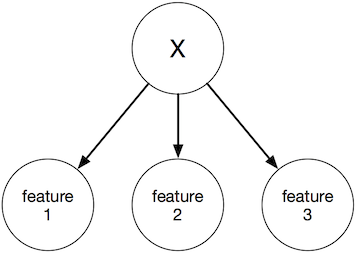

### Object

Always been used as Naive Bayes classifier.

### Assumption

The naive Bayes **assumption** is that the features are conditionally independently given the instance's class. More formally, we have that
$$((X_i \perp X_{-i})\mid C) \textrm{ for all }i$$

Based on these independence assumptions, we can show that the model factorizes as:
$$P(C,X_1,\dots,X_n)=P(C)\prod_{i=1}^n P(X_i\mid C)$$

A good example:



### Usage
```{r}
library(e1071)
data("Titanic")                                    # load data

model <- naiveBayes(Survived ~ ., data = Titanic)  # train naive Bayes classifier
model                                              # show model details
predict(model, as.data.frame(Titanic))             # do prediction
```

### Limitations